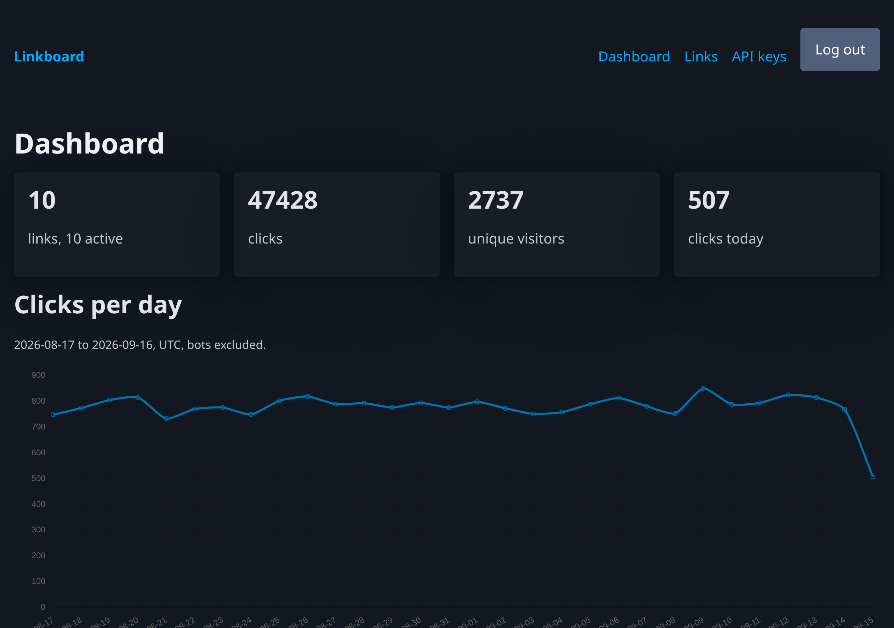
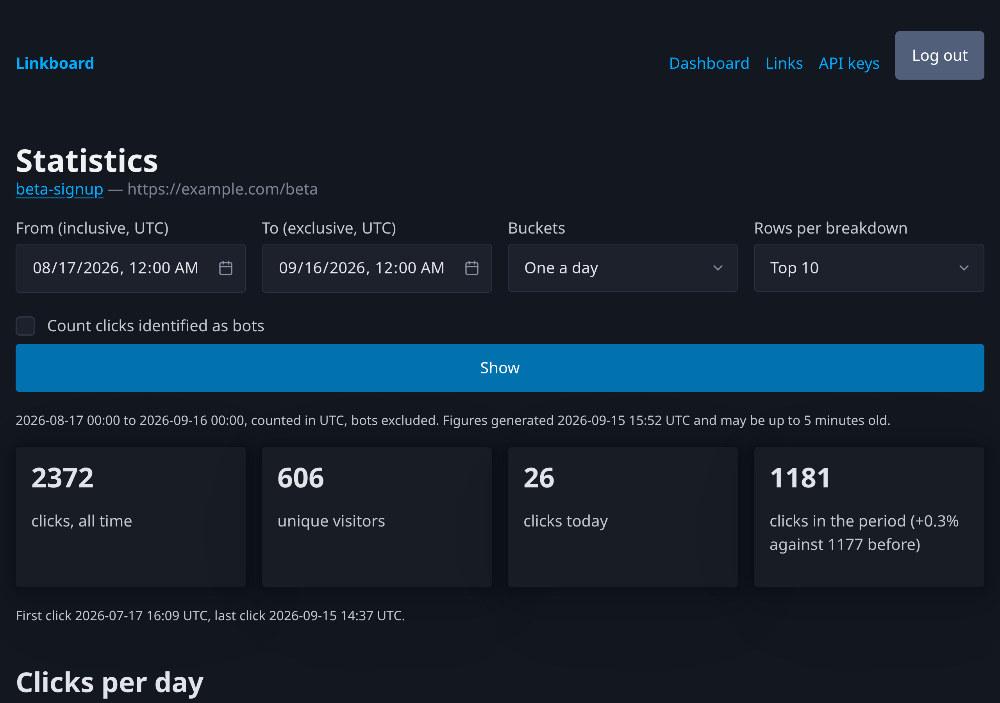
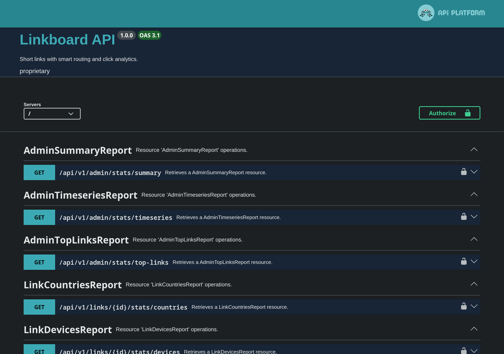

# Linkboard

A short-link service with smart routing and click analytics: links with
device, country and language rules and weighted A/B variants, a redirect that
answers in about 20 ms without waiting for anything to be written, and reports
computed by PostgreSQL window functions rather than by loops in PHP.

Built on PHP 8.4, Symfony 8.1, API Platform 4, Doctrine ORM 3 and Messenger
over PostgreSQL 16 and Redis 7. There is a JSON API and a server-rendered web
UI over the same services and the same security voters.



## What this project demonstrates

| | Where to look |
|---|---|
| **CQRS-lite done deliberately** — the click write path and the analytics read model share no entity, and an architecture test fails if they ever do | [ADR-002](docs/adr/ADR-002-cqrs-lite-click-and-analytics.md), [`tests/Unit/Architecture/`](tests/Unit/Architecture) |
| **Analytics in SQL** — `date_trunc`, `generate_series`, window functions, gap filling and running totals; nine reports, all cached with published staleness | [`src/Analytics/`](src/Analytics), [ADR-004](docs/adr/ADR-004-report-cache-staleness.md) |
| **A redirect that does not wait** — one indexed lookup, a rule match, a dispatch to Redis, 302; the click is persisted by a worker | [`src/Redirect/`](src/Redirect), [`src/Click/`](src/Click) |
| **Routing rules as validated JSONB** — device, country and language matching in an explicit order, plus deterministic A/B without cookies | [`src/Link/Rules/`](src/Link/Rules), [ADR-003](docs/adr/ADR-003-deterministic-ab-bucket.md) |
| **Two firewalls, one authorization model** — session login for the pages, JWT and hashed API keys for the API, the same voters behind both | [`src/Auth/`](src/Auth), [ADR-005](docs/adr/ADR-005-pages-answer-404.md) |
| **An OpenAPI document that is checked, not decorated** — every operation declares the statuses it can answer, and contract tests compare the document with real responses | [`tests/Api/Contract/`](tests/Api/Contract), [`docs/reference/api-errors.md`](docs/reference/api-errors.md) |
| **A web UI that works without JavaScript** — including the routing-rules editor; charts are an enhancement over tables that are always there | [`src/Web/`](src/Web), [`templates/`](templates) |
| **An AI-assisted workflow with independent review** — every change proposed, reviewed at risk-tiered gates by a second agent, and archived with its record | [AGENTS.md](AGENTS.md), [`openspec/changes/archive/`](openspec/changes/archive) |





## Quick start

```bash
make init      # build containers, install dependencies, generate JWT keys, migrate
make check     # style + static analysis + the whole test suite — the gate floor
```

The UI is at http://localhost:8082 and the API documentation at
http://localhost:8082/api/docs. For a populated instance:

```bash
docker compose exec php bin/console app:demo:seed --clicks=50000 --reset
```

It prints two accounts and their generated passwords once. `.env` is committed
with local defaults (Symfony convention); machine-specific overrides and real
credentials belong in `.env.local`, which is not.

## How it is built

[`docs/explanation/architecture.md`](docs/explanation/architecture.md) has the
diagram: the bounded contexts, the write path from redirect to `clicks`, the
read path from query services to cached DTOs, and where each boundary is
enforced.

## Measured, with the commands that measured it

| Target | Measured | |
|---|---|---|
| Redirect p95 ≤ 50 ms server time | **p50 20.4 ms, p95 ≈ 22 ms** | met |
| Report p95 ≤ 300 ms uncached on 1 M clicks | **8 of 9 reports, 43–169 ms** | met |
| — the global top-links report | **p95 303 ms** | missed, by 3 ms |
| Worker ≥ 500 clicks/s | **10 000 messages in 15.55 s → 643/s** | met |

[`docs/how-to/benchmarks.md`](docs/how-to/benchmarks.md) carries the commands,
the machine and the full distributions — including what the redirect's numbers
look like when the PHP-FPM pool, rather than the application, is the
bottleneck. One target is missed and is published as missed.

## Security notes

- **Two firewalls, one model.** Session login for the pages, JWT or a hashed
  API key for `/api/v1`; both resolve to the same user and the same voters, so
  a permission is defined once.
- **API keys are hashed at rest** (SHA-256) with a display prefix; the
  plaintext is sent in exactly one response and cannot be produced again.
- **A link that is not yours is a 404 on the pages** and a 403 in the API —
  deliberately, so a browser cannot enumerate identifiers
  ([ADR-005](docs/adr/ADR-005-pages-answer-404.md)).
- **Every page carries a content security policy** with a per-request nonce,
  `X-Frame-Options: DENY`, `X-Content-Type-Options: nosniff` and a referrer
  policy; session cookies are `HttpOnly`, `SameSite=Lax` and `Secure` outside
  development.
- **Rate limits** per client address on the authentication endpoints and per
  credential on the API, with `Retry-After` and allowance headers.
- **Blocking an account** is an administrator action behind a confirmation and
  a CSRF token, audited, and refused for one's own account.
- **The redirect never trusts a forwarded address** from an untrusted peer:
  the client IP comes from Symfony's trusted-proxy configuration.

## Where everything is

| You want to… | Go to |
|---|---|
| Run the project locally | [docs/how-to/local-development.md](docs/how-to/local-development.md) |
| Reproduce the benchmarks | [docs/how-to/benchmarks.md](docs/how-to/benchmarks.md) |
| Understand the architecture | [docs/explanation/architecture.md](docs/explanation/architecture.md) |
| Read the original brief with its requirement ids | [docs/explanation/requirements.md](docs/explanation/requirements.md) |
| Look up contributor commands | [docs/reference/commands.md](docs/reference/commands.md) |
| Understand an API error | [docs/reference/api-errors.md](docs/reference/api-errors.md) |
| See why any decision was made | [docs/adr/README.md](docs/adr/README.md) |
| See what is planned | [openspec/ROADMAP.md](openspec/ROADMAP.md) |
| See how AI agents work on this repo | [AGENTS.md](AGENTS.md) |
| Browse all documentation | [docs/README.md](docs/README.md) |
