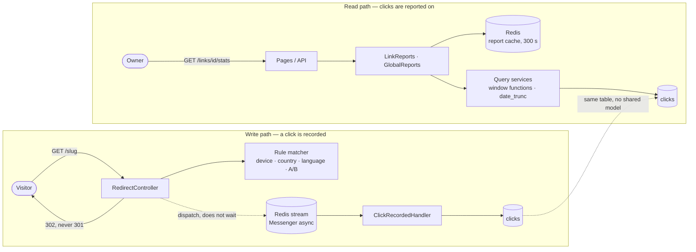

# Architecture

Linkboard is arranged around one decision: **the path that records a click and
the path that reports on clicks share no model**. Everything else — the
contexts under `src/`, the Messenger transport, the report cache — follows from
it. The decision and its alternatives are [ADR-002](../adr/ADR-002-cqrs-lite-click-and-analytics.md).

## The contexts

`src/` is split by bounded context, not by Symfony layer:

| Directory | What lives there |
|---|---|
| `src/Link/` | the link aggregate, its repository interface and Doctrine implementation, the API resource, the routing-rules document and its validator, and the use cases that are the one authority for link writes |
| `src/Redirect/` | the public `GET /{slug}` controller, the rule matcher and the device/geo resolvers |
| `src/Click/` | the `ClickRecorded` message and its handler — the write model of a click |
| `src/Analytics/` | the read model: query services over window functions, report DTOs, the tag-aware cache |
| `src/Auth/` | users, API keys, the two firewalls' pieces, the security voters, the rate limiters |
| `src/Web/` | the server-rendered pages, their forms and their controllers — the same services and voters the API uses |
| `src/Shared/` | kernel-level pieces: value objects, problem details, the clock, the health probe |

## The two paths

The dotted line is the whole point: the two paths meet at the `clicks` table
and nowhere else. The write path persists an entity; the read path never loads
one — it computes in SQL and returns immutable DTOs. `tests/Unit/Architecture/`
enforces that: a file under `src/Analytics/` naming a `Click` entity fails the
suite.

**What the write path buys.** The redirect answers 302 without waiting for the
click to be written: it dispatches to the Redis stream and returns. A database
that is slow, or a worker that is down, cannot turn a redirect into an error —
the messages wait. The cost is that a click is visible in the reports a moment
later than it happened, and that failure to log is invisible to the visitor,
which is the trade the specification asks for (FR-RED-2).

**What the read path buys.** Every report is one SQL statement with window
functions rather than a loop in PHP, and every answer is cached for 300 seconds
under a tag that a link write invalidates. Two consumers — the API and the
pages — call the same service and share one cache entry, so a page and
`GET /api/v1/links/{id}/stats/...` cannot disagree about a number. The cost is
bounded staleness, stated on the page and in `generatedAt`
([ADR-004](../adr/ADR-004-report-cache-staleness.md)).

## Where the boundaries are enforced

| Boundary | Mechanism | Checked by |
|---|---|---|
| Analytics never loads a click entity | code review and a rule | `tests/Unit/Architecture/AnalyticsKeepsItsDistanceTest.php` |
| Entities carry no persistence logic | DataMapper by convention | `tests/Unit/Architecture/EntitiesStayMappedTest.php` |
| Controllers build no queries | thin controllers, use cases below | `tests/Unit/Architecture/ControllersDoNotQueryTest.php` |
| A link belongs to its owner | `LinkVoter` on the resource — 403 in the API, 404 on the pages ([ADR-005](../adr/ADR-005-pages-answer-404.md)) | `tests/Api/Link`, `tests/Web/Stats/LinkStatsAccessTest.php` |
| The document describes what the API answers | an OpenAPI decorator plus contract tests | `tests/Api/Contract/` |
